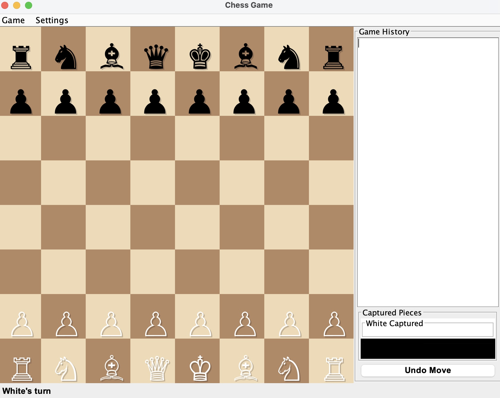

# Chess Game - GUI Application

**Team Name:** MineCraftVet  
**Team Member:** Ibrahim Balde  
**Course:** Fall 2025 CS 3354.R01

---

## 📸 Preview



*Screenshot of the Chess Game GUI interface showing the board, move history panel, and game controls.*

---

## 📊 Class Diagram

The project architecture is illustrated in the following UML class diagram:

**View the class diagram:**
- **File**: `ClassDiagram_Simple.puml` (PlantUML format)
- **Online Viewer**: Visit [PlantUML Online](http://www.plantuml.com/plantuml/uml/) and paste the contents of `ClassDiagram_Simple.puml`
- **VS Code**: Install PlantUML extension and preview the `.puml` file
- **Generate Image**: Use PlantUML to generate PNG/PDF: `plantuml ClassDiagram_Simple.puml`

**Diagram includes:**
- All classes with attributes and methods
- Access modifiers (public `+`, private `-`, protected `#`)
- Inheritance relationships (Piece → Pawn, Rook, etc.)
- Composition and aggregation relationships
- Multiplicity indicators (1, *, 0..1, 0..64, etc.)
- Package organization
- Notes on key design patterns

**Quick View**: Copy the contents of `ClassDiagram_Simple.puml` and paste into [PlantText](https://www.planttext.com/) for instant rendering.

**Key Components:**
- **board**: Board, Position classes
- **pieces**: Abstract Piece class with 6 concrete implementations (Pawn, Rook, Knight, Bishop, Queen, King)
- **game**: Game orchestration, Player, and AIPlayer classes
- **gui**: GUI components (ChessGUI, ChessBoardPanel, GameHistoryPanel, etc.)
- **network**: Network multiplayer support (ChessServer, ChessClient, NetworkMessage)

---

## 🚀 How to Compile, Start, and Run

### Prerequisites
- Java Development Kit (JDK) 8 or higher
- Java Runtime Environment (JRE)

### Compilation

**Compile all source files:**
```bash
javac -d . -cp . src/main/java/board/*.java \
              src/main/java/pieces/*.java \
              src/main/java/utils/*.java \
              src/main/java/game/*.java \
              src/main/java/gui/*.java \
              src/main/java/network/*.java \
              src/main/java/ChessGame.java
```

**Or compile individually by package:**
```bash
# Compile board package
javac -d . src/main/java/board/*.java

# Compile pieces package
javac -d . src/main/java/pieces/*.java

# Compile game package
javac -d . src/main/java/game/*.java

# Compile GUI package
javac -d . src/main/java/gui/*.java

# Compile network package
javac -d . src/main/java/network/*.java

# Compile main class
javac -d . -cp . src/main/java/ChessGame.java
```

### Running the Game

**GUI Mode (Recommended):**
```bash
java ChessGame
```
or
```bash
java ChessGame gui
```

**Console Mode:**
```bash
java ChessGame console
```

### Running Network Server

**Start the chess server:**
```bash
java network.ChessServer [port]
```

Default port is 8888 if not specified:
```bash
java network.ChessServer 8888
```

**Connect clients:**
1. Run `java ChessGame` on each computer
2. Select "Network Play (Online)"
3. Enter server IP address and port
4. First player connects as White, second as Black

See [NETWORK_PLAY.md](NETWORK_PLAY.md) for detailed network play instructions.

---

## ✅ Features Checklist

### Core Chess Features
- ✅ **Complete Chess Board**: 8x8 board with all pieces in starting positions
- ✅ **All Piece Types**: Pawn, Rook, Knight, Bishop, Queen, King
- ✅ **Piece Movement Rules**: All pieces follow standard chess movement rules
- ✅ **Check Detection**: Identifies when a king is in check
- ✅ **Checkmate Detection**: Game ends when checkmate occurs
- ✅ **Pawn Promotion**: Automatic promotion to Queen (or user choice in console mode)
- ✅ **Capture Mechanics**: Pieces can capture opponent pieces
- ✅ **Turn Management**: Enforces alternating turns between players
- ✅ **Move Validation**: Validates all moves according to chess rules
- ✅ **Illegal Move Prevention**: Prevents moves that put own king in check

### GUI Features
- ✅ **Graphical User Interface**: Full Swing-based GUI with visual board
- ✅ **Click-and-Move**: Click piece, then click destination
- ✅ **Drag-and-Drop**: Drag pieces to move them
- ✅ **Visual Piece Representation**: Unicode chess piece symbols
- ✅ **Move History Panel**: Displays all moves made in the game
- ✅ **Captured Pieces Display**: Shows captured pieces in history panel
- ✅ **Status Bar**: Shows current turn and check status
- ✅ **Menu Bar**: Game controls (New Game, Save, Load, Settings, Exit)
- ✅ **Save/Load Game**: Save game state to file and load later
- ✅ **Undo Functionality**: Undo last move (GUI mode)
- ✅ **Board Customization**: Customize square colors and board size
- ✅ **Settings Dialog**: Easy-to-use settings interface
- ✅ **Game Over Dialog**: Displays winner when game ends
- ✅ **Error Messages**: User-friendly error dialogs for invalid moves

### AI Player Features
- ✅ **AI Opponent**: Play against computer AI
- ✅ **Minimax Algorithm**: Uses Minimax with Alpha-Beta pruning
- ✅ **Configurable Difficulty**: Search depth of 3 levels
- ✅ **Board Evaluation**: Evaluates positions using piece values and positional bonuses
- ✅ **Legal Move Generation**: AI only makes legal moves
- ✅ **Smart Move Selection**: AI chooses best moves based on evaluation
- ✅ **Automatic Pawn Promotion**: AI promotes pawns to Queen automatically

### Network Multiplayer Features
- ✅ **Network Play**: Play against remote opponents over the internet
- ✅ **Server-Client Architecture**: Dedicated server for hosting games
- ✅ **Real-Time Synchronization**: Board updates automatically on both clients
- ✅ **Turn Enforcement**: Server enforces turn-based gameplay
- ✅ **Connection Management**: Handles client connections and disconnections
- ✅ **IP Address Connection**: Connect via IP address and port
- ✅ **Board Flipping**: Board automatically flips for Black player perspective
- ✅ **Network Error Handling**: Graceful handling of network errors

### Game Modes
- ✅ **Two Players (Same Computer)**: Two human players on one computer
- ✅ **Play Against Computer**: Human vs AI
- ✅ **Network Play**: Two players over network/internet
- ✅ **Console Mode**: Text-based interface for console play

### Additional Features
- ✅ **Serialization**: All game state classes implement Serializable
- ✅ **Object-Oriented Design**: Clean architecture with proper separation of concerns
- ✅ **Package Organization**: Well-organized packages (board, pieces, game, gui, network)
- ✅ **Comprehensive Documentation**: Full Javadoc comments throughout codebase
- ✅ **Error Handling**: Robust error handling and validation
- ✅ **Code Reusability**: Abstract classes and interfaces for extensibility

---

## 📁 Project Structure

```
chessgame/
├── src/main/java/
│   ├── board/
│   │   ├── Board.java          # Chessboard management and game state
│   │   └── Position.java       # Position representation
│   ├── pieces/
│   │   ├── Piece.java          # Abstract base class for all pieces
│   │   ├── Pawn.java           # Pawn implementation
│   │   ├── Rook.java           # Rook implementation
│   │   ├── Knight.java         # Knight implementation
│   │   ├── Bishop.java         # Bishop implementation
│   │   ├── Queen.java          # Queen implementation
│   │   └── King.java           # King implementation
│   ├── game/
│   │   ├── Game.java           # Console game orchestration
│   │   ├── Player.java          # Human player implementation
│   │   └── AIPlayer.java       # AI player with Minimax algorithm
│   ├── gui/
│   │   ├── ChessGUI.java       # Main GUI window
│   │   ├── ChessBoardPanel.java # Board rendering and interaction
│   │   ├── GameHistoryPanel.java # Move history display
│   │   ├── SettingsDialog.java  # Settings configuration
│   │   ├── MoveRecord.java     # Move tracking
│   │   └── GameState.java      # Game state serialization
│   ├── network/
│   │   ├── ChessServer.java    # Network game server
│   │   ├── ChessClient.java    # Network game client
│   │   └── NetworkMessage.java # Network protocol
│   ├── utils/
│   │   └── Utils.java          # Utility functions
│   └── ChessGame.java          # Main entry point
├── ClassDiagram_Simple.puml    # UML class diagram
├── NETWORK_PLAY.md             # Network play instructions
├── FIND_IP_ADDRESS.md          # IP address finding guide
└── README.md                   # This file
```

---

## 🎮 How to Play

### Starting a Game

1. **Launch the application:**
   ```bash
   java ChessGame
   ```

2. **Select game mode:**
   - **Two Players**: Play with another person on the same computer
   - **Play Against Computer**: Play against AI (choose your side)
   - **Network Play**: Connect to a remote server to play online

3. **Make moves:**
   - **Click-and-Move**: Click a piece, then click destination
   - **Drag-and-Drop**: Drag piece to destination
   - **Console Mode**: Enter moves in format `FROM TO` (e.g., `E2 E4`)

### Game Controls

- **New Game**: Start a fresh game
- **Save Game**: Save current game state to file
- **Load Game**: Load previously saved game
- **Undo**: Undo last move (GUI mode only)
- **Settings**: Customize board appearance
- **Exit**: Quit the application

### Chess Rules

- **Check**: King is under attack (must move or block)
- **Checkmate**: King is in check with no legal moves (game over)
- **Pawn Promotion**: Pawn reaching opposite end promotes to Queen (or chosen piece)
- **Turn-Based**: Players alternate turns
- **Move Validation**: All moves must be legal according to chess rules

---

## 🔧 Technical Details

### Design Patterns
- **Abstract Factory**: Piece hierarchy with abstract Piece class
- **Strategy Pattern**: Different movement rules for each piece type
- **Observer Pattern**: Network message listeners and GUI updates
- **MVC Pattern**: Model (Board), View (ChessBoardPanel), Controller (ChessGUI)

### Technologies Used
- **Java**: Core programming language
- **Java Swing**: GUI framework
- **Java Networking**: Socket programming for network play
- **Serialization**: Save/load functionality

### Key Algorithms
- **Minimax with Alpha-Beta Pruning**: AI move selection
- **Board Evaluation**: Position scoring for AI decisions
- **Legal Move Generation**: Comprehensive move validation

---

## 📚 Additional Documentation

- **[NETWORK_PLAY.md](NETWORK_PLAY.md)**: Detailed network multiplayer guide
- **[FIND_IP_ADDRESS.md](FIND_IP_ADDRESS.md)**: How to find server IP addresses
- **[CLASS_DIAGRAM_README.md](CLASS_DIAGRAM_README.md)**: Class diagram viewing instructions

---

## 🐛 Troubleshooting

### Common Issues

**Compilation Errors:**
- Ensure all source files are present
- Check Java version (requires JDK 8+)
- Verify package structure matches directory structure

**Runtime Errors:**
- Make sure all `.class` files are in the correct location
- Check that you're running from the project root directory
- Verify Java classpath includes current directory

**Network Connection Issues:**
- Check firewall settings
- Verify server is running before clients connect
- Ensure correct IP address and port number
- See [FIND_IP_ADDRESS.md](FIND_IP_ADDRESS.md) for IP address help

**GUI Not Displaying:**
- Ensure Swing is available (included in standard Java)
- Check display settings and resolution
- Try console mode if GUI has issues

---

## 📝 License

This project is developed for educational purposes as part of CS 3354 course requirements.

---

## 👥 Credits

**Development Team:**
- Ibrahim Balde - Full-stack development, AI implementation, Network features

**Course Information:**
- **Course**: CS 3354
- **Section**: R01
- **Semester**: Fall 2025
- **Institution**: [Your Institution Name]

---

## 🔮 Future Enhancements

Potential features for future development:
- Castling implementation
- En passant capture
- Stalemate detection
- Move hints and suggestions
- Advanced AI difficulty levels
- Tournament mode
- Replay functionality
- Analysis mode

---

*Last Updated: Fall 2025*
